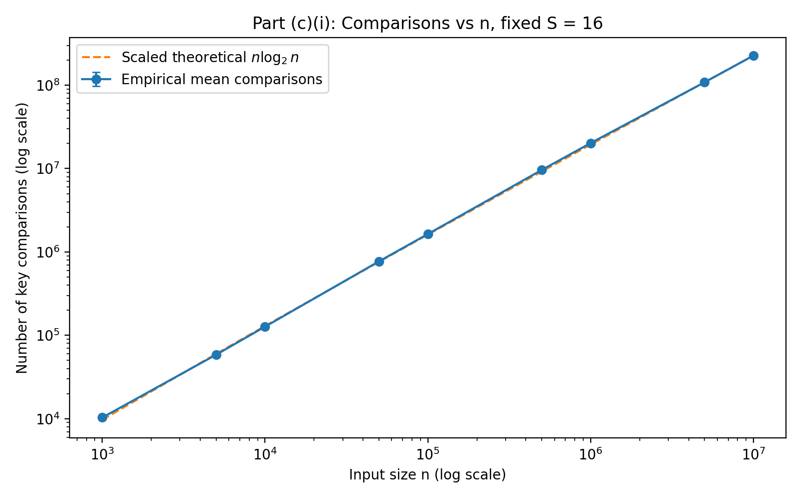
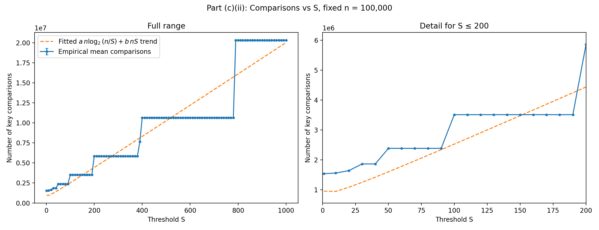
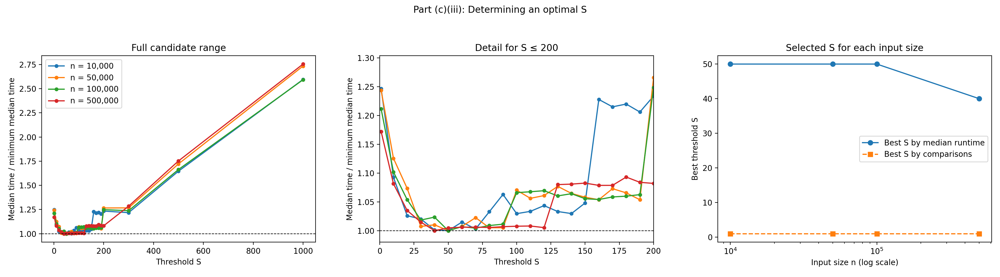
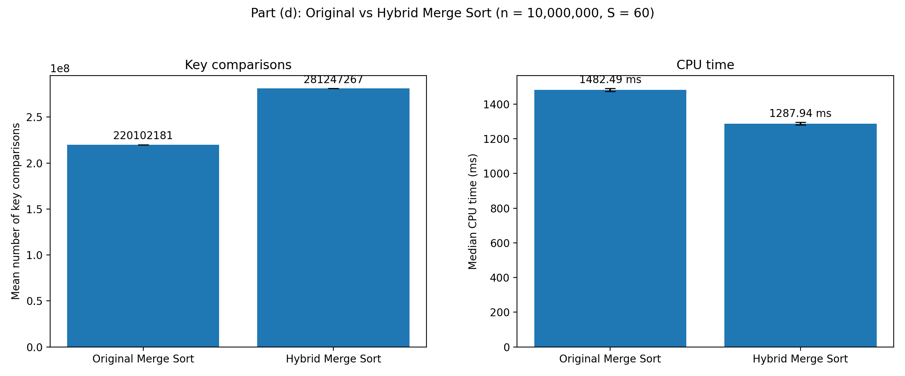

# Merge Sort Experiments

This project evaluates a Hybrid Merge Sort that switches to Insertion Sort
when a subarray contains at most `S` elements.

## Experimental setup

- Random integers are uniformly generated from 1 to 1,000,000.
- The base seed is `20260910`, so the datasets are reproducible.
- Every configuration is tested 10 times. Algorithms being compared receive
  identical input arrays.
- A key comparison is a comparison between two array values. Array-index and
  loop-control comparisons are excluded.
- Array generation and correctness checking are excluded from measured times.
- Mean key comparisons and median times are reported. Median time is used to
  reduce the effect of occasional timing outliers.

## Part (c)(i): Fixed S, different input sizes

`S` was fixed at 16 and `n` ranged from 1,000 to 10,000,000. The measured key
comparisons closely followed the `n log2(n)` reference curve. Therefore, when
`S` is fixed, the Hybrid Merge Sort has time complexity:

```text
Theta(n log n)
```



## Part (c)(ii): Fixed input size, different S values

`n` was fixed at 100,000 and `S = 1, 10, 20, ..., 1000` was tested. The
theoretical comparison growth is:

```text
Theta(n log(n / S) + nS)
```

The merge term decreases as `S` increases, but the Insertion Sort term grows.
For these random datasets, the Insertion Sort term eventually dominates. The
fewest key comparisons occurred at `S = 1`; the count increased from about
1.54 million at `S = 1` to 20.32 million at `S = 1000`.

The step-shaped empirical curve is expected. Since Merge Sort repeatedly
halves each subarray, several consecutive `S` values can produce the same leaf
subarrays and therefore the same number of comparisons.



## Part (c)(iii): Choosing an optimal S

The runtime experiment used `S = 1, 10, 20, ..., 200`, followed by the wider
checkpoints `300`, `500`, and `1000`.

| Input size n | Best S by median runtime | Best S by key comparisons |
|---:|---:|---:|
| 10,000 | 50 | 1 |
| 50,000 | 50 | 1 |
| 100,000 | 50 | 1 |
| 500,000 | 40 | 1 |

The exact runtime optimum changes slightly because nearby candidates have very
similar times and runtime measurements contain system noise. The consistently
fast region was approximately `S = 40` to `S = 90`. Thus, `S = 60` was selected
as a stable general-purpose threshold.

The comparison-count optimum remained `S = 1`, but this does not give the
shortest runtime. Small Insertion Sort subproblems can execute faster despite
performing more key comparisons because they avoid recursive and merge
overheads.



## Part (d): Original Merge Sort vs Hybrid Merge Sort

Both algorithms sorted identical datasets containing 10 million integers. The
Hybrid Merge Sort used `S = 60`. Current-thread CPU time was measured, and the
algorithm execution order was alternated between trials to reduce ordering
bias.

| Algorithm | Mean key comparisons | Median CPU time |
|---|---:|---:|
| Original Merge Sort | 220,102,181 | 1482.49 ms |
| Hybrid Merge Sort (`S = 60`) | 281,247,267 | 1287.94 ms |

The Hybrid Merge Sort performed 27.8% more key comparisons but used 13.1% less
CPU time, giving a speedup of approximately 1.15 times. Its advantage comes
from lower recursion and merge overhead on small subarrays, not from reducing
the number of key comparisons.



## Run

```bash
javac java/ArrayGenerator.java java/MergeSort.java java/HybridMergeSort.java java/Metrics.java java/ExperimentRunner.java
java -cp java ExperimentRunner
python3 python/plot_results.py results
```

Run these commands from the repository root. CSV data is written to `results/`.
The generated figures are written to `plots/`.
